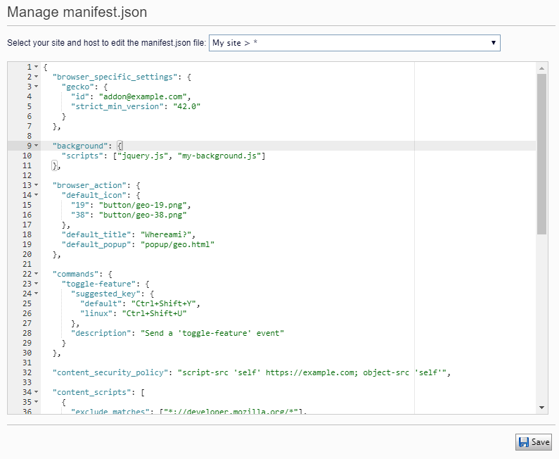

# Episerver manifest.json handler
This plugin allows administrator to manage manifest.json within Episerver CMS.
It is much inspired by [POSSIBLE.RobotsTxtHandler](https://github.com/markeverard/POSSIBLE.RobotsTxtHandler)


How to use
--
1. Use new admin tool to manage the content of manifest.json for each site.
2. Put ```<link rel="manifest" href="manifest.json">``` on header of page.

History
--
2020-05-22: first release
